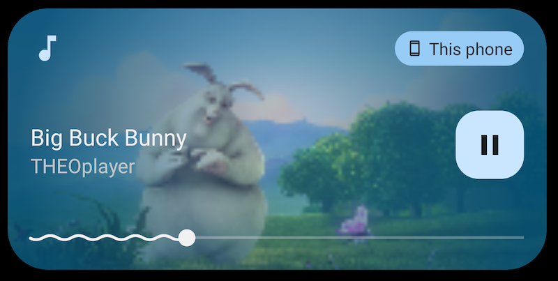
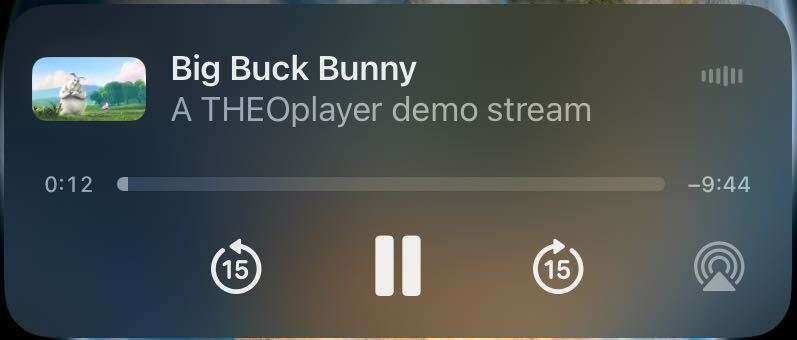
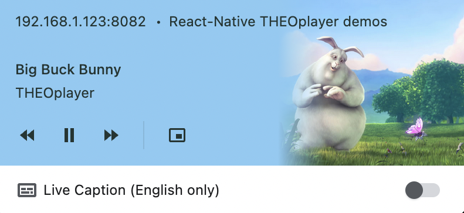

# Background Playback and Notifications

## Overview

One of the key features of `react-native-theoplayer` is its support for background playback,
notifications, and lock-screen controls. This feature allows your users to continue listening
to audio when the app is not in the foreground, and control playback using notifications and lock-screen controls.

## Configuration

The `backgroundAudioConfiguration` player configuration affects the play-out behaviour when the app is moved to
the background: in case the `enabled` property is set to `true`, the current media asset will continue
playing when the app is moved to the background, otherwise play-out will pause.

The configuration can be modified at run-time, allowing the player to pause depending on the current media asset's
properties, or whether an ad is playing or not.

```typescript
player.backgroundAudioConfiguration = { enabled: true };
```

Other properties of the `backgroundAudioConfiguration` can be used to further customize the background playback:

| Field                           | Platform           | Purpose                                                                                                                                                               | Default                           |
|---------------------------------|--------------------|-----------------------------------------------------------------------------------------------------------------------------------------------------------------------|-----------------------------------|
| `enabled`                       | Web, iOS & Android | If enabled, playback continues when transitioning to background.                                                                                                      | `false`                           |
| `stopOnBackground`              | Web, iOS & Android | If enabled, fully stop playback when the app goes to the background. The player will need to be provided with a new source when the app comes back to the foreground. | `false`                           |
| `shouldResumeAfterInterruption` | iOS                | Controls whether playback should automatically resume after an interruption, such as an incoming phone call.                                                          | `false`                           |                                                                                                                                                                       |         |
| `audioSessionMode`              | iOS                | Specifies the [AVAudioSession.Mode](https://developer.apple.com/documentation/avfaudio/avaudiosession/mode)                                                           | `AudioSessionMode.MOVIE_PLAYBACK` |                                                                                                                                                                       |         |

A use case for enabling `stopOnBackground` could be a live stream that should not be allowed to continue in the
background, neither in paused nor playing state. The app should be designed to reload the source or the player page when coming back
to the foreground.

### Android

On Android, a [service](https://developer.android.com/guide/components/services) is used to
continue playback in the background while the user is not interacting with the app.

It is possible to disable the service at build time by setting the build config field
`'THEOplayer_usePlaybackService = false'`.
In that case the background playback feature is always disabled, no notifications are displayed, and the
player will always pause when the hosting app goes to the background.

## Notifications, Metadata and Lockscreen Controls

During play-out of a media asset, a notification is displayed that provides some metadata and
enables basic control. The source description passed to the player should provide the necessary metadata
properties:

```typescript
const source = {
  // ...
  poster: 'https://cdn.theoplayer.com/video/big_buck_bunny/poster.jpg',
  metadata: {
    title: 'My stream title',
    subtitle: 'A subtitle or artist',
    nowPlayingServiceIdentifier: 'serviceId',
    nowPlayingContentIdentifier: 'contentId',
    displayIconUri: 'https://cdn.theoplayer.com/video/big_buck_bunny/poster.jpg',
  }
}
```

The following fields from the source description are used to display information in the lockscreen:

| Field                                                                | Purpose           |
|----------------------------------------------------------------------|-------------------|
| `source.metadata.title`                                              | Lockscreen title  |
| `source.metadata.artist` with fallback to `source.metadata.subtitle` | Lockscreen artist |
| `source.metadata.displayIconUri` with fallback to `source.poster`    | Lockscreen image  |

The following fields allow additional configuration for the lockscreen behaviour on iOS:

| Field                                         | Purpose                          |
|-----------------------------------------------|----------------------------------|
| `source.metadata.nowPlayingServiceIdentifier` | Info property service identifier |
| `source.metadata.nowPlayingContentIdentifier` | Info property content identifier |

|  |  |  |
|-----------------------------------------------------|:-------------------------------------------:|:-------------------------------------------:|
| Android                                             |                     iOS                     |                     Web                     |

### Configuration

The `mediaControl` property of `PlayerConfiguration` hosts properties that affect the notifications, media sessions and
controls on each platform. The following table describes the available configuration options:

| Field                  | Platform           | Purpose                                                                                                                                                                        | Default                         |
|------------------------|--------------------|--------------------------------------------------------------------------------------------------------------------------------------------------------------------------------|---------------------------------|
| `mediaSessionEnabled`  | Web & Android      | If disabled, no media session properties or actions will be set.                                                                                                               | `true`                          |
| `skipForwardInterval`  | Web, iOS & Android | If disabled, no media session properties or actions will be set.                                                                                                               | `5` (Web & Android), `15` (iOS) |
| `skipBackwardInterval` | Web, iOS & Android | If disabled, no media session properties or actions will be set.                                                                                                               | `5` (Web & Android), `15` (iOS) |
| `convertSkipToSeek`    | iOS & Android      | A flag that allows next/previous track commands to be interpreted as skip forward/backward commands, according to the configured skip intervals.                               | `false`                         |
| `allowLivePlayPause`   | iOS & Android      | A flag that indicates whether play/pause controls for live streams are enabled.                                                                                                | `true` (iOS), `false` (Android) |
| `seekToLiveOnResume`   | iOS & Android      | A flag that controls whether to seek to the live edge when resuming a paused live stream. Note that `allowLivePlayPause` needs to be enabled for this property to have effect. | `false`                         |
