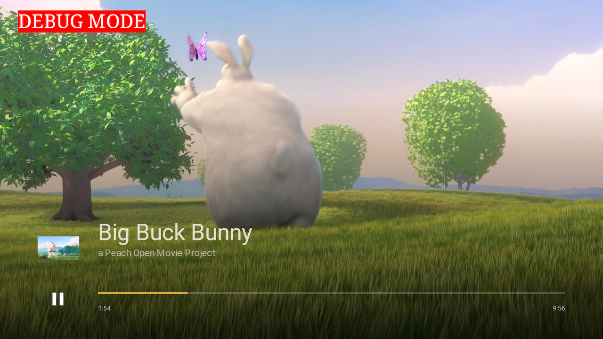

# Casting with Chromecast and Airplay

## Overview

The basics of both Chromecast and Airplay are well-described in
THEOplayer's [Knowledge Base](https://docs.theoplayer.com/how-to-guides/03-cast/01-chromecast/00-introduction.md).
The `react-native-theoplayer` package has support for both.

This page first outlines the setup
needed for Chromecast and Airplay, and then describes the player's cast API and events subscription, which is common for both.

## Chromecast

### Setup

To enable Chromecast, react-native-theoplayer provides a cast module on the player (player.cast) that allows you to start/stop/join/leave chromecast sessions. The THEOplayer SDK will take care of the interactions with the cast receiver (communicating source updates, seeking, play/pause, ...) and route all cast events through its API.

We can also recommend the [`react-native-google-cast`](https://github.com/react-native-google-cast/react-native-google-cast)
package, which comes with native support for both iOS and Android. It is fully-featured and provides the possibility to
manage devices and cast sessions, send new source descriptions and listen for cast events. It also includes a `<CastButton>` component that can be added to the app's UI, as demonstrated in
the [example app](example-app.md).

```tsx
<CastButton
  style={styles.castButton}
  tintColor={chromecastConnected ? '#ffc50f' : 'white'}
/>
```

This button represents a native media route button that shows the connection state and opens a device dialog when tapped. Using `react-native-google-cast`'s functionality does require some extra steps, such as communicating source updates, managing player status on both sender and receiver and handling the cast events. Our react-native-theoplayer integration already takes care of these tasks. The [installation instructions](https://react-native-google-cast.github.io/docs/getting-started/installation)
for `react-native-google-cast` cover the steps to enable support for Chromecast in your app through that component.

For the rest of this document we assume that THEOplayer handles this logic. Enabling the player with Chromecast support requires a different approach on each platform.

<details>
<summary>Android</summary>

The Android SDK is modular-based, so enabling Chromecast is limited to including
the cast extension in gradle by setting this flag in your `gradle.properties`:

```
# Enable THEOplayer Extensions (default: disabled)
THEOplayer_extensionCast = true
```

</details>

<details>
<summary>iOS</summary>

#### Add feature flag to config

To enable Chromecast on react-native-theoplayer 2.x versions and higher, you can add the "CHROMECAST" [feature flag](./creating-minimal-app.md#getting-started-on-ios-and-tvos) to react-native-theoplayer.json (or theoplayer-config.json)

#### iOS Configuration

Specify NSBonjourServices in your Info.plist to allow local network discovery to succeed on iOS 14. You will need to add
both _googlecast._tcp and _[your-app-id]._googlecast._tcp as services for device discovery to work properly.

Update your applications info.plist with the following example NSBonjourServices definition, replacing "ABCD1234" with
your appID.

```xml

<key>NSBonjourServices</key>
<array>
<string>_googlecast._tcp</string>
<string>_ABCD1234._googlecast._tcp</string>
</array>
```

We also recommend that you customize the message shown in the Local Network prompt by adding an app-specific permission
string in your app's Info.plist file for the NSLocalNetworkUsageDescription such as to describe Cast discovery and other
discovery services.

```xml

<key>NSLocalNetworkUsageDescription</key>
<string>${PRODUCT_NAME} uses the local network to discover Cast-enabled devices on your WiFi
network.
</string>
```

#### Combining with react-native-google-cast

When using react-native-google-cast to render the CastButton, their documentation suggest to setup the CastContext as
soon as possible. We noticed that waiting to prepare this context to a later point in time (i.e. till the AppId is
bridged from RN) fails to display that CastButton. To prevent this follow
the [instructions](https://react-native-google-cast.github.io/docs/getting-started/setup#ios) (or check our example
application) to setup the GCKCastContext in the AppDelegate.

The following options on the GCKCastOptions can be set as desired:
1. options.startDiscoveryAfterFirstTapOnCastButton = false;  (set up how/when the castbutton is shown)
2. options.suspendSessionsWhenBackgrounded = false;			 (set up the connection response be when backgrounding the app)

In addition, react-native-google-cast currently does not include a full featured (guest mode combined with Apple M1 support) setup of the Google Cast SDK. Our THEOplayerCastIntegration however does, but combining both results in a clash of dependencies (both delivering a GoogleCast.xcframework). To overcome this double dependency we suggest to use a [fork of react-native-google-cast](https://github.com/Danesz/react-native-google-cast/tree/feature/guestmode_apple_silicon) that depends on the same GoogleCast.xcframework. To achieve this:
1. Add the following to your applications podFile:
```ruby
pod 'react-native-google-cast', :git => 'https://github.com/Danesz/react-native-google-cast.git', branch: 'feature/guestmode_apple_silicon'
```
2. Prevent the autolinking of the original by updating your react-native.config.js with:
```json
'react-native-google-cast': {
	platforms: {
		ios: null,
	},
},
```
</details>

<details>
<summary>Web</summary>

The `react-native-google-cast` package has no support for Web yet. If the THEOplayer Web SDK's default UI is used
however, the cast button will be included here and there is no need to install `react-native-google-cast`.

The web page hosting the player just needs to load the Google cast sender module:

```html

<script src="https://www.gstatic.com/cv/js/sender/v1/cast_sender.js?loadCastFramework=1"></script>
```

</details>

### THEOplayerView configuration

In the configuration of a `THEOplayerView` component you can set the
receiver's appID. This only makes sense on a Web platform, as for mobile platforms this value
is already set natively through `CastOptionsProvider` on Android and `AppDelegate` on iOS:

```javascript
const playerConfig: PlayerConfiguration = {
  cast: {
    chromecast: {
      appID: '<receiverAppID>'
    },
    strategy: 'auto'
  }
}
```

The [example app](./example-app.md) sets appID to `'CC1AD845'`, which refers to Google's default V3 receiver.
This receiver implementation will know how to play the manifest/playlist URL sent by THEOplayer, but it does not
have knowledge on how to handle any additional information from the source description provided through the
`MediaInfo.customData` [field](https://developers.google.com/android/reference/com/google/android/gms/cast/MediaInfo.Builder#public-mediainfo.builder-setcustomdata-jsonobject-customdata).
As a consequence, to enable playback of for example DRM-protected streams or ads, a custom receiver needs to
be created that also handles these parts of the source description.

We refer to our [sample-google-cast-v3-receiver](https://github.com/THEOplayer/samples-google-cast-v3-receiver/)
repository for an example on how to interpret a THEOplayer source description and handle a custom DRM flow.

### Cast strategy

The `strategy` property indicates the *join strategy* that will be used when starting/joining sessions:

- `auto`: The player will automatically join a cast session if one exists when play is called.
- `manual` (**default**): The player needs to start or join the session manually using its cast API. See next section
  for details.
- `disabled`: The player is not affected by cast sessions and is not castable.

In case the join strategy `manual` is chosen and a cast session is started by `react-native-google-cast`, it is
necessary
to explicitly let the player either join or take over the current session.
This can be done by listening to the cast state and using the player's cast API to either start or join:

```typescript
import CastContext, {CastState} from "react-native-google-cast";

useEffect(() => {
  const subscription = CastContext.onCastStateChanged((castState) => {
    if (castState === CastState.CONNECTED) {
      // Let the player either start or join the session.
      player.cast.chromecast?.start();
    }
  })
  return () => subscription.remove()
}, [])
```

The [example app](./example-app.md) uses strategy `auto` so the player will automatically
send its source description when a session is created.

### Providing metadata

The `metadata` object, as part of the source configuration, is used to send additional information
to the receiver. Common fields include `poster`, `title`, `subtitle`, `album` and `artist`.

```json
{
  "sources": [
    {
      "src": "https://cdn.theoplayer.com/video/dash/bbb_30fps/bbb_with_multiple_tiled_thumbnails.mpd",
      "type": "application/dash+xml"
    }
  ],
  "poster": "https://cdn.theoplayer.com/video/big_buck_bunny/poster.jpg",
  "metadata": {
    "title": "Big Buck Bunny",
    "subtitle": "a Peach Open Movie Project",
    "album": "React-Native THEOplayer demos",
    "artist": "THEOplayer"
  }
}
```

|  |
|---------------------------------|
| Casting a stream with metadata. |

## Airplay

For iOS and Web Safari, also Airplay is supported. Similar to chromecast, you can listen to or check the airplay cast
state and use the player's Airplay API to either start or join an Airplay session. When implementing a simple airplay
button you can toggle Airplay using:

```typescript
player.cast.airplay?.state().then((airplayCastState) => {
  const inConnection = airplayCastState === 'connected' || airplayCastState === 'connecting'
  if (inConnection) {
    player.cast.airplay?.stop()
  } else {
    player.cast.airplay?.start()
  }
})
```

## Cast API

The `THEOplayerView` provides the [THEOplayer API](../src/api/player/THEOplayer.ts) using the `onPlayerReady` callback,
where you can access the [CastAPI](../src/api/event/CastEvent.ts) to control or start cast sessions, either Chromecast or Airplay.
## Subscribing to Cast Events

The `THEOplayerView` provides the [THEOplayer API](../src/api/player/THEOplayer.ts) using the `onPlayerReady` callback,
where you can subscribe to cast events:

```tsx
const onCastEvent = (event: CastEvent) => {
    console.log(event);
}

const onReady = (player: THEOplayer) => {
    player.addEventListener(PlayerEventType.CAST_EVENT, onCastEvent);
}

<THEOplayerView onPlayerReady={onReady}/>
```
