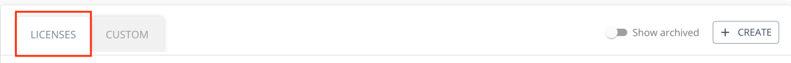

## Creating a minimal demo app

In this section we start from an empty React Native template, include a dependency to `react-native-theoplayer`,
and deploy it on an Android or iOS device.

A user interface is added using the `@theoplayer/react-native-ui` package.

### Table of Contents
- [Setting up a new project](#setting-up-a-new-project)
- [Getting started on Android](#getting-started-on-android)
- [Getting started on iOS](#getting-started-on-ios-and-tvos)
- [Getting started on Web](#getting-started-on-web)
- [Building and running the app](#building-and-running-the-app)
- [Adding a user interface](#adding-a-user-interface)

### Setting up a new project

In the following steps we will be using `npm` as the Node.js package manager.

First initialize a new project with a React Native app template:

```bash
$ npx react-native init rntheodemo --template=react-native-template-typescript
$ cd rntheodemo
```

Alternatively use a template that also provides support for tvOS, as it will create a dependency to
`react-native-tvos`, a fork of the main React Native branch:

```bash
$ npx react-native init rntheodemo --template=react-native-template-typescript-tv@6.5.8-0
$ cd rntheodemo
```

Next, include the dependency to `react-native-theoplayer`.

```bash
$ npm i
$ npm i react-native-theoplayer
```

or optionally specifying a specific version of the package:

```bash
$ npm i react-native-theoplayer@<version>
```

Note: depending on your node version, an extra `--legacy-peer-deps` option has to be added:

```bash
$ npm i react-native-theoplayer --legacy-peer-deps
```

Finally, replace the `App.tsx` with this minimal code:

```tsx
import React from 'react';
import {Platform, View} from 'react-native';
import {PlayerConfiguration, SourceDescription, PlayerEventType, THEOplayer, THEOplayerView} from 'react-native-theoplayer';

const playerConfig: PlayerConfiguration = {
  license: undefined,     // insert THEOplayer React Native license here
};

const source: SourceDescription = {
  sources: [
    {
      src: "https://cdn.theoplayer.com/video/elephants-dream/playlist-single-audio.m3u8",
      type: "application/x-mpegurl"
    },
  ],
};

const onReady = (player: THEOplayer) => {
  player.autoplay = true
  player.source = source;
  player.addEventListener(PlayerEventType.ERROR, console.log);
}

const App = () => {
  return (
    <View style={{position: 'absolute', top: 0, left: 0, bottom: 0, right: 0}}>
      <THEOplayerView config={playerConfig} onPlayerReady={onReady}/>
    </View>
  );
};

export default App;
```

When configuring a stream that is hosted on another server than `cdn.theoplayer.com`,
a license for the React Native SDK needs to be obtained through the 'Licenses' built in the [THEOplayer portal](https://portal.theoplayer.com/)
or request a [free trial license](https://www.theoplayer.com/free-trial-theoplayer?hsLang=en-us).



### Getting started on Android

After completing the [initial project setup](#setting-up-a-new-project), which is shared for all platforms,
the following Gradle buildConfig fields can be used in your `gradle.properties` file to override or
set various Android-specific react-native-theoplayer options:

```groovy
# Version of the (Android) THEOplayer SDK, if not specified, the latest available version is set.
#THEOplayer_sdk=5.0.3

# Override Android sdk versions
#THEOplayer_compileSdkVersion = 33
#THEOplayer_minSdkVersion = 21
#THEOplayer_targetSdkVersion = 33

# Toggle player event logging using tag 'VideoPlayer' (default: false)
#THEOplayer_logPlayerEvents = true

# Toggle playerView event logging using tag 'ReactTHEOplayerView' (default: false)
#THEOplayer_logViewEvents = true

# Toggle media session event logging (default: false)
#THEOplayer_logMediaSessionEvents = true

# Enable THEOplayer Extensions (default: disabled)
#THEOplayer_extensionGoogleIMA = true
#THEOplayer_extensionGoogleDAI = true
#THEOplayer_extensionCast = true
#THEOplayer_extensionMediaSession = true

# Optionally limit timeUpdate rate, which could improve performance.
# Possible values: (default: UNLIMITED)
# - com.theoplayer.TimeUpdateRate.UNLIMITED
# - com.theoplayer.TimeUpdateRate.LIMITED_ONE_HZ
# - com.theoplayer.TimeUpdateRate.LIMITED_TWO_HZ
# - com.theoplayer.TimeUpdateRate.LIMITED_THREE_HZ
#THEOplayer_timeUpdateRate = com.theoplayer.TimeUpdateRate.LIMITED_TWO_HZ
```

For optimal performance, make sure to build your app in release mode, and  optionally limit the number of `timeupdate`
events send by the player as shown in the config above. A `timeupdate` event typically triggers a number of
React Native component updates and could affect performance in negative way.

### Getting started on iOS and tvOS

To define which extra THEOplayer integrations need to be loaded for additional features (currently: IMA ads and/or chromecast) a config file needs to be added to you application folder:

Create a json file at **[YourApplicationFolder]/react-native-theoplayer.json** (Should be on the same level as the node_modules folder)

Edit the file to reflect the features required for your application. The following example adds Google IMA, Chromecast and Sideloaded textTracks to the setup. If one of these is out of your applications scope, you can leave it out to reduce the app's size. When using only basic functionality, leave the features array empty. 
Example:
```
{
	"ios": {
		"features": [
			"GOOGLE_IMA",
			"CHROMECAST",
			"SIDELOADED_TEXTTRACKS"
		]
	}
}
```
- **GOOGLE_IMA**: adds an additional dependency to the THEOplayer-Integration-GoogleIMA cocoapod that delivers the IMA functionality
- **CHROMECAST**: adds an additional dependency to the THEOplayer-Integration-GoogleCast cocoapod that delivers the chromecast functionality
- **SIDELOADED_TEXTTRACKS**: adds an additional dependency to the THEOplayer-Connector-SideloadedSubtitle cocoapod that delivers the sideloaded texttracks functionality

Once the project has been setup correctly, set the source to a valid HLS stream, eg.
```typescript
const source = {
  sources: [
    {
      src: 'https://cdn.theoplayer.com/video/elephants-dream/playlist.m3u8',
      type: 'application/x-mpegurl',
    },
  ],
};
```
Some RN templates miss a specific Swift version setting for tvOS. To fix this add a custom build setting to your tvOS app target:
```
SWIFT_VERSION 5.0
```

Run pod install in your app's ios folder
```bash
pod install
```

### When working with a 4.x tvOS THEOplayer SDK
When using a 4.x SDK, you need an additional change for tvOS, since the tvOS SDK needs to be prepared before it can be used in a RN context. First, include TheoplayerSDK into your project's AppDelegate:
```swift
#if TARGET_OS_TV
#import <THEOplayerSDK/THEOplayerSDK-Swift.h>
#endif
```
Next, prepare the THEOplayer right after the creation of the rootViewController in your AppDelegate's didFinishLaunchingWithOptions:
```swift
#if TARGET_OS_TV
  [THEOplayer prepareWithFirstViewController: [UIViewController new]];
#endif
```

### Getting started on Web

Make sure to first complete the [initial project setup](#setting-up-a-new-project), which is shared for all platforms.
Deploying a web app requires a little more work. The example uses [react-native-web](https://necolas.github.io/react-native-web/) to
support web-based platforms, which translates React Native components to React DOM components.
In addition, the project relies on webpack to create the bundle that is loaded in the hosting web page.

We refer to the [example application](example-app.md) and its [code](../example/web/) for a full demonstration.

#### libraryConfiguration

When passing the `PlayerConfiguration` object while creating the player, the
[`libraryConfiguration`](https://docs.theoplayer.com/api-reference/web/theoplayer.playerconfiguration.md#librarylocation) parameter specifies
where the THEOplayer web worker files are located. The worker files are dynamically loaded and
necessary to play-out MPEG-TS based HLS streams. By default it is set to the location where npm installed THEOplayer
('./node_modules/theoplayer').

### Building and running the app

Finally, build and deploy the app. Make sure an emulator is available, or there is a physical
device connected to deploy to.

```bash
$ npm run android
$ npm run ios
$ npm run web
```

### Adding a user interface

The `react-native-theoplayer` package does not contain a user interface by default. There is however a separate package
that builds a UI on top of the `THEOplayerView` component, `@theoplayer/react-native-ui`.

We refer to the [documentation](https://github.com/THEOplayer/react-native-theoplayer-ui) of
`@theoplayer/react-native-ui` on how to install and use it.

