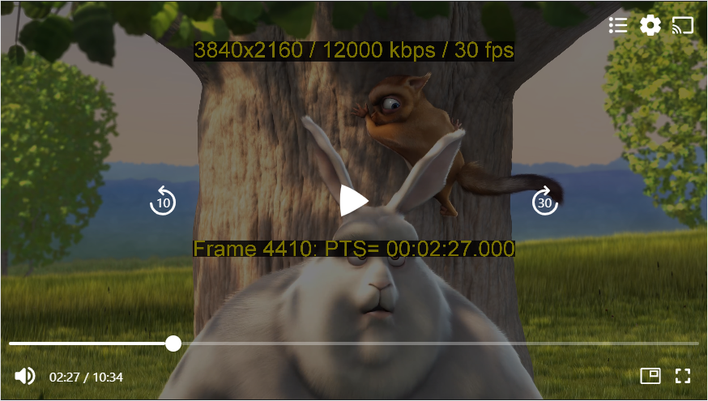
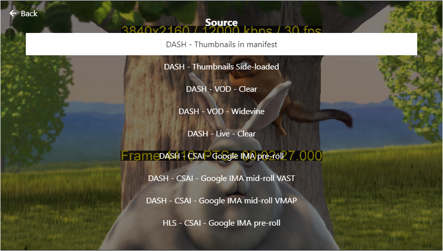

# Example Application

The example application on our `react-native-theoplayer`
[git repository](https://github.com/THEOplayer/react-native-theoplayer/tree/master/example) demonstrates how the use the
player with the `THEOplayerView` component and the UI components from `@theoplayer/react-native-ui`.

The example app depends on [`react-native-tvos`](https://github.com/react-native-tvos/react-native-tvos),
a fork of the main `react-native` repository, to properly include support for Apple TV.

In this section we cover building and running the example app. If you would like to know more about the
`DefaultTHEOplayerUi` and all the other UI components,
visit [our React Native UI project](https://github.com/THEOplayer/react-native-theoplayer-ui).

|  |  |  |
|-------------------------------------------------------------------------------|--------------------------------------------------------|--------------------------------------------------|
| The `DefaultTHEOplayerUi` in action.                                          | Choosing a demo source from a custom UI component.     | Preview thumbnails.                              |

## Building the example application

Clone the repository and install the dependencies for the `react-native-theoplayer` package:

```bash
$ git clone react-native-theoplayer
$ cd react-native-theoplayer
$ npm i
```

Install dependencies for the example application:

```bash
$ (cd example && npm i)
```

For iOS and tvOS, also make sure to install pod dependencies

```bash
$ (cd example/ios && pod install)
```

Make sure to configure your [THEOplayer license](https://portal.theoplayer.com/),
or [free trial license](https://www.theoplayer.com/free-trial-theoplayer?hsLang=en-us), in
the [app config](../example/src/App.tsx).

Finally, after making sure the necessary development tools are installed, build & deploy the example:

```bash
$ cd example
$ npm run android
$ npm run ios
$ npm run web
```
