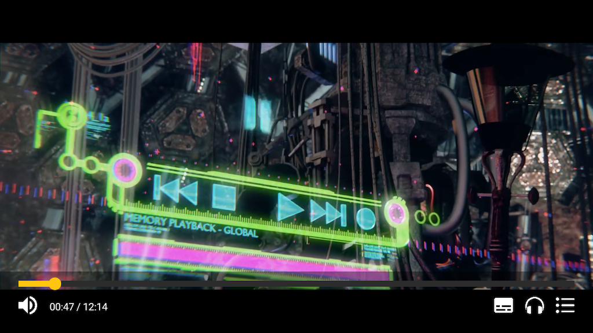
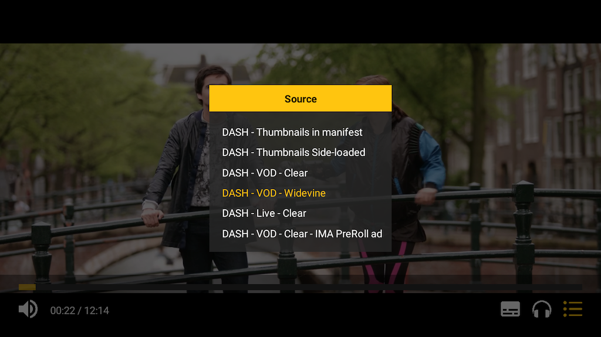
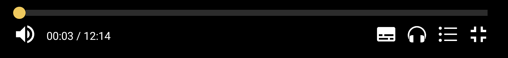
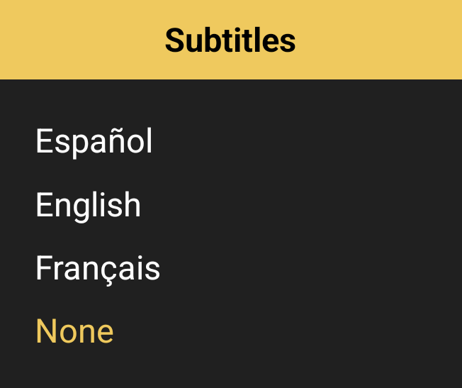
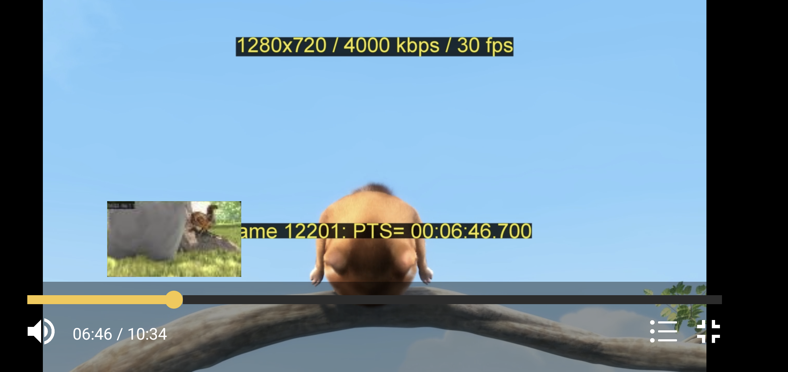

## Example Application

The `react-native-theoplayer` package only provides the `THEOplayerView` component.
The example application on our react-native-theoplayer
[git repository](https://github.com/THEOplayer/react-native-theoplayer/tree/develop/example) demonstrates how to integrate
the component in a single-page app with a basic UI that allows interaction on both touch-based and remote-controlled devices.

The example app depends on [`react-native-tvos`](https://github.com/react-native-tvos/react-native-tvos),
a fork of the main `react-native` repository, to properly include support for Apple TV.

In this section we cover building and running the example app, and discuss the basic features of the accompanying
user interface implementation.

|           |  |
|--------------------------------------|-------------------------------------------|
| The example app with basic controls. | Choosing a demo source.                   |

### Table of Contents
- [Building the example application](#building-the-example-application)
- [User interface](#user-interface)
  - [Controls](#controls)
  - [Preview thumbnails](#preview-thumbnails)

### Building the example application

Clone the repository and install the dependencies for the `react-native-theoplayer` package:

```bash
$ git clone react-native-theoplayer
$ cd react-native-theoplayer
$ npm i
```

Install dependencies for the example application:

```bash
$ (cd example && npm i)
```

For iOS and tvOS, also make sure to install pod dependencies

```bash
$ (cd example/ios && pod install)
```

Make sure to configure your [THEOplayer license](https://portal.theoplayer.com/),
or [free trial license](https://www.theoplayer.com/free-trial-theoplayer?hsLang=en-us), in the [app config](../example/src/App.tsx).

Finally, after making sure the necessary development tools are installed, build & deploy the example:

```bash
$ cd example
$ npm run android
$ npm run ios
$ npm run web
```

### User interface

The example application comes with a number of [example sources](../example/src/res/sources.json) demonstrating
various features of the SDK.
It also includes basic UI components that can optionally be integrated or used as an inspiration in
your own application.

#### Controls

Depending on the selected source and the [features](./features.md) supported on the platform, the UI displays various controls:

- A progress bar for seeking to a specific location in the stream, either touch-based or remote control-based, depending on the platform
- A mute/unmute toggle button
- A time and total duration indication
- A menu for selecting the active audio track
- A menu for enabling or disabling a text track
- A button for switching to another source
- A button for switching to/from fullscreen

|  |     |
|-----------------------------|-----|
| Controls                    |    Subtitle menu |


#### Preview thumbnails

If the source contains a thumbnail track, either side-loaded or inside the source manifest, the
`ThumbnailView` component attached to the progress bar will display a thumbnail image at the current
time.

The `ThumbnailView` component supports two modes: `single`, where a single thumbnail is rendered above
the progress bar's current time dot; and `carousel`, displaying a list of images around the current time.

|     |     |          |
|-----|-----|----------------------------------------------------------------|
|   The `ThumbnailView` in mode `single`.  |   The `ThumbnailView` in mode `carousel`.  | The `ThumbnailView` in mode `carousel` with scaled thumbnails. |


