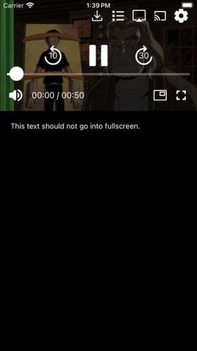

# A Fullscreen Video Player Component

Presenting a fullscreen video player poses challenges due to the need to seamlessly
transition between the regular view and fullscreen mode, while maintaining playback continuity.
This involves managing UI layers, native view hierarchies, and minimizing
disruptions during the transition process.

On this page we will present two ways of presenting a fullscreen player component. One that opens a
new screen to present the player, and a second that transitions to fullscreen from an inline player.
We will also discuss the related concept of "React Portals", which, when paired with a video player component,
offer versatile applications beyond fullscreen display.

## Presenting a fullscreen video player

A native iOS or Android video player that transitions into fullscreen typically creates another activity
or view that _overlays the existing view stack_, while activating an immersive mode to maximize
screen size.
This also introduces a new user interface layer that includes essential playback controls and a method for
exiting fullscreen mode.

React Native, as a UI framework, makes it possible to create a screen with UI elements such a buttons
and text elements, and provides a means to create stacked views with packages such as
[react-native-navigation](https://reactnavigation.org/). It manages the lifecycle of the native UI elements, and
may encounter issues when elements are generated outside its control.

When an app integrates a video player that needs the ability to present itself in fullscreen mode, there are
typically two possibilities to transition to the fullscreen player:

### 1. A separate player screen

Navigate to a _separate player screen_ that contains only the video player presented in an immersive mode.

The first option has the advantage that it is simple and straightforward to implement. The main disadvantage is that
transitioning to another screen means recreating (remounting) the player, causing a visual interruption in playback.
Typically, this option is used when the first screen has an inline preview image that transitions to a fullscreen player
screen when tapped.

### 2. An inline video player

Make the current _inline video player_ component stretch itself while covering all elements in the current screen.

The second option is able to let a video play inline with the other screen elements. The player is a part of the
view hierarchy and will need to cover the whole screen without remounting the player component.

|                                  |                                  |
|---------------------------------------------------------------|-----------------------------------------------------------|
| Transitioning from an inline player to fullscreen on Android. | Transitioning from an inline player to fullscreen on iOS. |

The `react-native-theoplayer` SDK supports this option on iOS and Android by re-parenting the native view to the
top-most node of the view hierarchy when the player's presentation mode is set to `fullscreen`.

```ts
import { PresentationMode } from './PresentationMode';

player.presentationMode = PresentationMode.fullscreen;
```

When the player transitions back to inline mode, the view hierarchy will be restored.

## Portals

A [Portal](https://react.dev/reference/react-dom/createPortal#usage) is a well-known concept in React that
enables rendering a component in a different location in the DOM view hierarchy. Normally, when a component is
rendered, it is mounted into the DOM as a child of the nearest parent node. Sometimes, however, it is useful
to let the child mount at a different location in the DOM tree. Internally, the portal will also re-parent the
view to a different node in the view hierarchy, similar to the approach `react-native-theoplayer` takes when
going to fullscreen.

A typical use case is when the child component needs to "break out" of its container. Examples are dialogs,
tooltips, and floating or fullscreen video components. In the next section we will outline the creation of an
in-app mini player.

## Using Portals to transition to an in-app mini player

This section introduces a basic example illustrating how Portals facilitate the creation of an inline video component
capable of transitioning to a mini player at the bottom of the screen, overlaying the other components.

There are many packages available that bring Portal functionality to React Native. However, we will
use [a package](https://www.npmjs.com/package/@alexzunik/rn-native-portals-reborn) that not only renders the component to an alternate location in the DOM tree, but also
_relocates the native view to a different parent in the native view hierarchy_.
This approach aims to prevent the remounting of the complex video component.

```tsx
export default function App() {
  const [isMiniPlayer, setMiniPlayer] = useState(false);

  const onPlayerReady = (player: THEOplayer) => {
    // set-up player
  }

  return (
    <View style={styles.container}>
      <PortalOrigin destination={isMiniPlayer ? 'miniplayer' : null}>
        <View style={isMiniPlayer ? styles.videoContainerMini : styles.videoContainer}>
          <THEOplayerView config={playerConfig} onPlayerReady={onPlayerReady}>
            {player !== undefined && (<UiContainer>{/*left out for clarity*/}</UiContainer>)}
          </THEOplayerView>
        </View>
      </PortalOrigin>

      <View style={styles.contentContainer}>
        <Text style={{ color: '#ffffff' }}>This text will remain on screen when play-out continues into the mini-player.</Text>
      </View>

      <View style={isMiniPlayer ? styles.miniContainer : styles.miniContainerInactive}>
        <PortalDestination name="miniplayer" />
      </View>
    </View>);
}
```

The player component along with its UI container in the example above is wrapped in a `PortalOrigin`.
Its destination is left `null` as long as the player is presented inline.

When the `isMiniPlayer` state property is set to `true`, the screen is re-rendered with destination set to `'miniplayer'`.
The player component will become a child of the `PortalDestination` with the same name. On a native level the view
will also be re-parented to the miniPlayer container at the bottom of the screen.

|           | 
|----------------------------------------|------------------------------------|
| A mini-player using Portals on Android | A mini-player using Portals on iOS |

## Closing remarks

Variants of the approach discussed above put the `PortalDestination` on a dedicated route in a
[`NavigationContainer`](https://reactnavigation.org/docs/navigation-container/). This is
especially useful in a more complex app that has different routes towards showing the player component.
