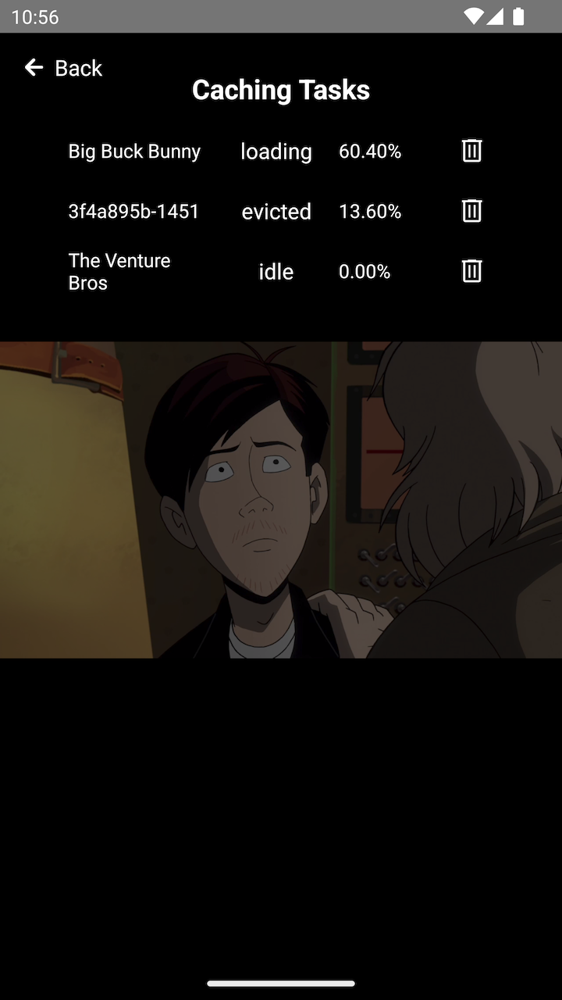

# Media Cache

## Overview

The Media Cache API is available as of v3.0.0 and facilitates the download of media assets for offline playback.
This section provides an overview of how to utilize the Media Caching API,
create caching tasks, and control the media cache.

The process of caching a media asset involves several steps to enable offline playback.
It starts with the creation and initiation of a CachingTask, which downloads the media content for local storage.
Once cached, the asset can be played offline seamlessly.

The Media Cache feature is accessible on all platforms except for tvOS.

This page is structured as follows:

- [Caching Workflow](#caching-workflow)
- [Creating a CachingTask](#creating-a-cachingtask)
- [Controlling the CachingTask](#controlling-the-cachingtask)
- [Listening for Cache events](#listening-for-cache-events)
- [Using React hooks](#using-react-hooks)
- [Known Limitations](#known-limitations)

### Caching Workflow
Caching a media asset encompasses the following stages:

- CachingTask creation: The caching process commences by creating a CachingTask, which orchestrates the downloading of the media content for offline access.

- Starting the CachingTask: Once the CachingTask is established, the download process is initiated using the start() method. This triggers the download of the complete media stream to the device's local storage.

- Offline Playback: After successful caching, the cached media asset can be played offline. This is accomplished by providing the original source to the player. The player checks if the asset is available offline; if it is, playback occurs from the local cache. If not, the player fetches the content from the network.

## Creating a CachingTask

To initiate the download process of a media asset, you need to create a `CachingTask`.
This task requires two essential parameters: a `SourceDescription` specifying the asset
to be cached, and `CachingTaskParameters` that define caching settings.

Below is an example of creating a caching task:

```typescript
// The source we want to cache.
const source = {
    sources: [
        {
            src: "https://cdn.theoplayer.com/video/big_buck_bunny/big_buck_bunny.m3u8",
            type: "application/x-mpegurl"
        }
    ],
    metadata: {
        title: "Big Buck Bunny"
    }
} as SourceDescription;

// Caching parameters
const parameters = {
    // Cache the whole stream
    amount: '100%',

    // Cache for 24 hours
    expirationDate: new Date(Date.now() + 24 * 60 * 60 * 1000),

    // Cache quality
    bandwidth: 2000000,
} as CachingTaskParameters;

// Create a caching task
const task = await MediaCache.createTask(source, parameters);
```

## Controlling the CachingTask

Once the `CachingTask` is created, it enters the `idle` state. To initiate the download process:
```typescript
task.start();
```

Additionally, you can pause or remove the task from the media cache using these methods:

```typescript
task.pause();
task.remove();
```

## Listening for Cache events

Both `MediaCache` and `CachingTask` instances dispatch events to notify about changes and status updates.

### MediaCache events

The `MediaCache` dispatches the following events:

| Event name    | Purpose                                                                                            |
|---------------|----------------------------------------------------------------------------------------------------|
| `statechange` | Dispatched if the status of the Media Cache changes from `uninitialised` to `initialised`. |
| `addtask`     | Dispatched if a new `CachingTask` is added to the `MediaCache.tasks` list.                         |
| `removetask`  | Dispatched if `CachingTask` is removed from the `MediaCache.tasks` list.                           |

As an example, listening to the `addtask` event is done as follows:

```typescript
MediaCache.addEventListener(CacheEventType.addtask, (event: AddCachingTaskEvent) => {
    console.log('[MediaCache] a new task was added: ', event.task.id);
  }
);
```

### CachingTask events

Each individual `CachingTask` also dispatches events to advertise changes in `progress` or `status`.

| Event name    | Purpose                                                                                                            |
|---------------|--------------------------------------------------------------------------------------------------------------------|
| `statechange` | Dispatched if the status of the task changes. Possible values are `idle`, `loading`, `done`, `error` or `evicted`. |
| `progress`    | Dispatched on a regular interval while `loading`.                                                                  |

As an example, listening for `progress` events is done as follows:

```typescript
task.addEventListener(CachingTaskEventType.progress, () => {
    console.log('[MediaCache]', `Progress for task ${task.id}: ${task.percentageCached}`);
});
```

## Using React hooks

For convenience, React hooks are available to simplify handling caching tasks without the need to subscribe or
unsubscribe to listeners.

### useCachingTaskList

This hooks listens for updates in the `MediaCache.tasks` list, and returns the updated list.

```jsx
function TaskListView(props: {debug: boolean}) {
    const tasks = useCachingTaskList(props.debug);
    return <View style={styles.container}>
        {tasks.map((task, index) => <Text key={index} style={styles.taskListItem}>{task.id}</Text>)}
    </View>
}
```

### useCachingTaskProgress and useCachingTaskStatus

These hooks listen for updates in both progress and status of a `CachingTask`.

```jsx
function CachingTaskView(props: {task: CachingTask, debug: boolean}) {
    const { task, debug } = props;
    const status = useCachingTaskStatus(task, debug);
    const progress = useCachingTaskProgress(task, debug);
    return <View>
        <Text>{`status: ${status}`}</Text>
        <Text>{`progress: ${progress}`}</Text>
    </View>
}
```

## The Example App

The example app that is part of this repository demonstrates the Media Cache features through
a basic user interface. It provides a menu with options to start caching the currently selected
source, and show a list of the currently available caching tasks.

|  |  |
|--------------------------------|--------------------------------|

## Known Limitations
