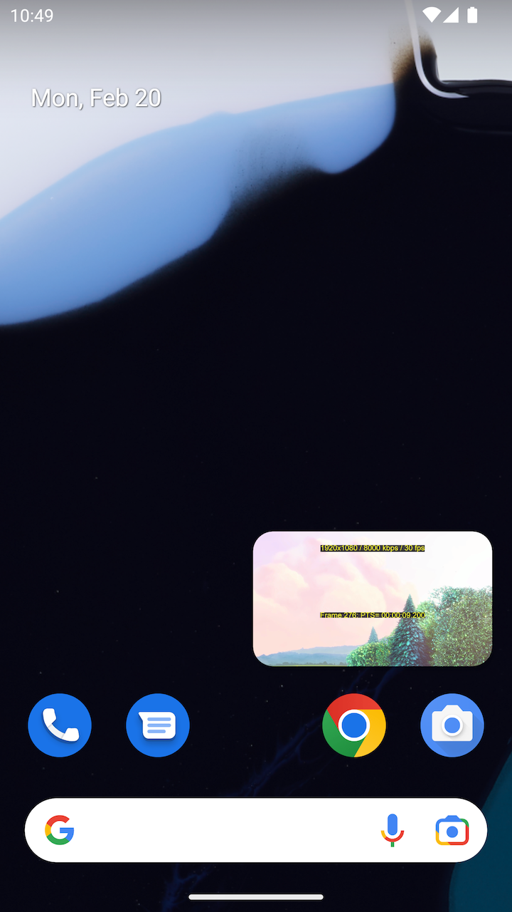
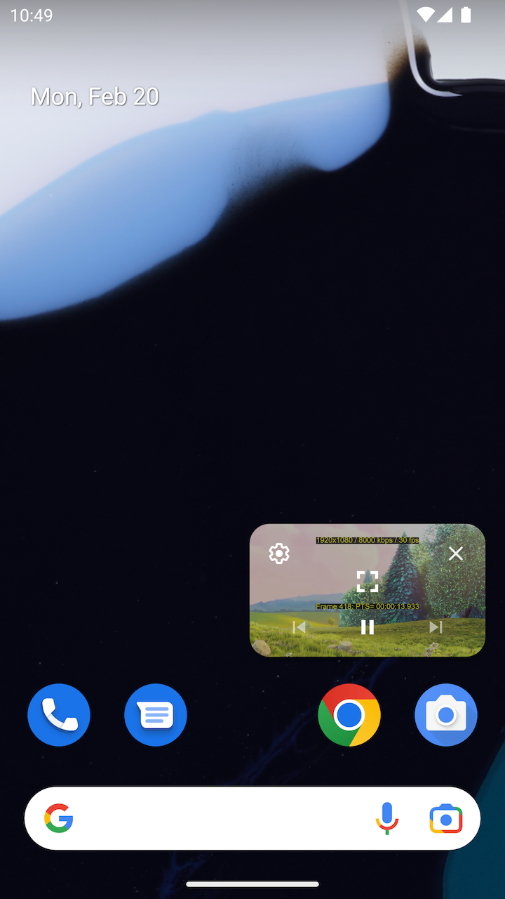

## Picture-in-Picture (PiP)

### Overview

The Picture-in-Picture feature allows you to watch a stream in a floating window that is always
on top of other apps or windows.

Transitioning the player to a PiP window can be done in two ways:

- Explicitly, using the player API
- Automatically, when transitioning to background in mobile apps.

This page describes how to configure PiP with react-native-theoplayer.

### Configuration

The `PlayerConfiguration` object that is passed when creating a `THEOplayerView` component
allows native mobile apps on iOS and Android to automatically go into PiP presentation mode when

```typescript
const playerConfig: PlayerConfiguration = {
  pip: {
    // Automatically switch to PiP when the app goes to background.
    canStartPictureInPictureAutomaticallyFromInline: true,
  },
};
```

The picture-in-picture presentation mode can also be triggered explicitly using the
`THEOplayer` API:

```typescript
// Change presentation mode ('inline', 'fullscreen' or 'picture-in-picture').
player.presentationMode = 'picture-in-picture';
```

Additional configuration is necessary depending on the platform the app runs on.

### Android

On Android the react-native app is typically a single-activity application. Launching picture-in-picture
mode means the whole activity transitions to an _out-of-app_ PiP window.

To enable PiP support, make sure to set `android:supportsPictureInPicture=true` in the
app's manifest, and specify that the activity handles layout configuration changes
so that it does not relaunch when layout changes occur during PiP mode transitions.

```groovy
<activity
  android:name=".MainActivity"
  android:configChanges="screenSize|smallestScreenSize|screenLayout|orientation"
  android:supportsPictureInPicture="true">
</activity>
```

Also, add these methods to the `MainActivity` to let react-native know
when the app makes PiP, background and foreground transitions:

```kotlin
public override fun onUserLeaveHint() {
    // Notify the app is backgrounded in case the user taps home or back, and
    // the app needs to transition to PiP automatically.
    this.sendBroadcast(Intent("onUserLeaveHint"))
    super.onUserLeaveHint()
}

override fun onPictureInPictureModeChanged(
    isInPictureInPictureMode: Boolean,
    newConfig: Configuration
) {
    // Notify that the app is changing its picture-in-picture mode.
    super.onPictureInPictureModeChanged(isInPictureInPictureMode, newConfig)
    val intent = Intent("onPictureInPictureModeChanged")
    intent.putExtra("isInPictureInPictureMode", isInPictureInPictureMode)
    this.sendBroadcast(intent)
}

public override fun onStop() {
    super.onStop()
    // The activity is done and should be closed and its task should be completely removed.
    finishAndRemoveTask()
}
```

The PiP window will show the default controls to configure, maximize and close the PiP window.
In addition, the active media session enables a play/pause toggle button and (disabled) play-list
navigator buttons.

|     |             |   |
|---------------------------------------------------|:----------------------------------------------------------:|:-----------------------------:|

More information on Android PiP support can be found on the [Android developer pages](https://developer.android.com/develop/ui/views/picture-in-picture).

### iOS


### Web

On web the behavior is similar to iOS, where PiP can be started manually from
the UI. It will open up a floating PiP window displaying the video element.
