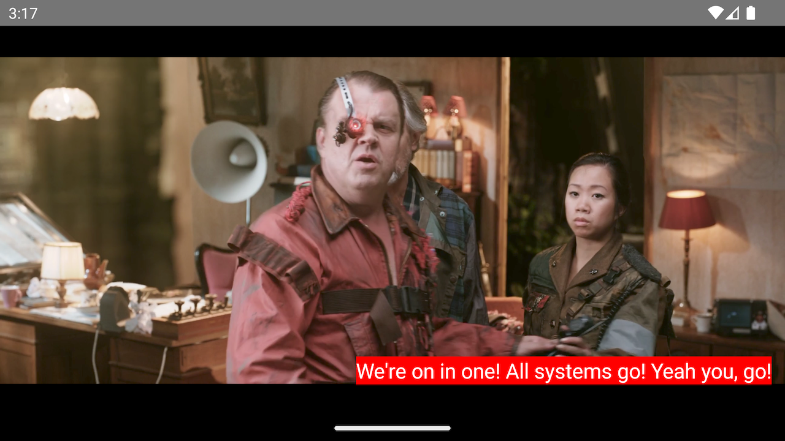
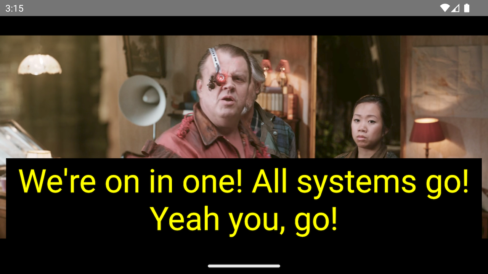
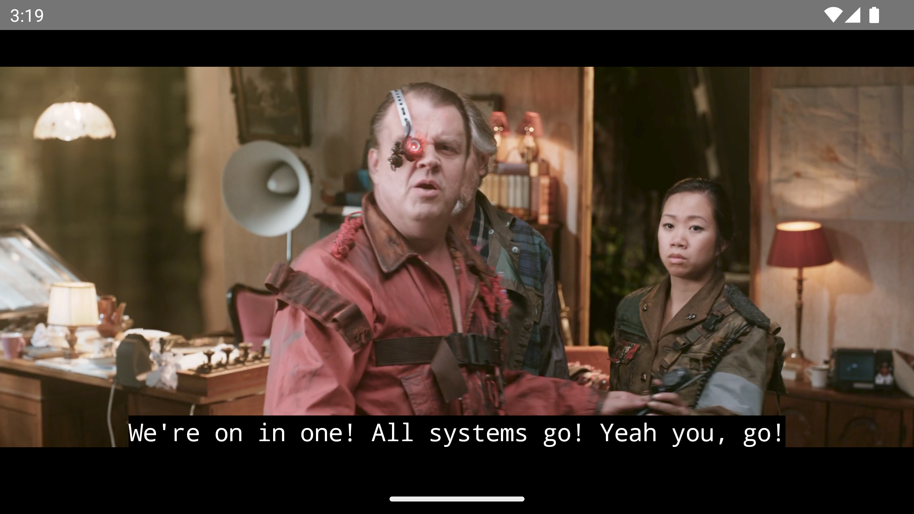

## Subtitles, Closed Captions and Metadata tracks

THEOplayer's `TextTrack` api gives developers the capability to manage and manipulate various types of text-based content.
Some of its key functionalities include text track selection, styling, and listening to track and cue events.

### Table of Contents
- [Types of text tracks](#types-of-text-tracks)
- [Side-loaded text tracks](#side-loaded-text-tracks)
- [Listening to text track events](#listening-to-text-track-events)
- [Enabling a text track](#enabling-a-text-track)
- [Preview thumbnails](#preview-thumbnails)
- [Styling subtitles and closed captions](#styling-subtitles-and-closed-captions)

### Types of text tracks

In this document we will differentiate between the following kinds of text tracks:

- **Subtitles**, which are text-based translations of the dialogue or narrative of a video;
- **Closed Captions (CC)**, which go beyond subtitles by providing additional information about sound effects, music, and other audio cues;
- **Metadata tracks**, which are used for providing non-textual information about the video, such as thumbnail urls or program boundaries in a live stream.

In addition, a distinction can be made between how a text track is delivered to the player:

- **In-band** refers to text tracks that are embedded within the video or audio media stream itself.
- **Out-band**, or *out-of-band*, is used to describe text tracks that are delivered separately from the media file. They are typically described in the playlist or manifest.
- **Side-loaded** text tracks are those that are manually added or loaded by the user through the source description.

### Side-loaded text tracks

In contrast to in-band and out-band text tracks, which are delivered to the player through the media content itself,
the side-loaded text tracks can be configured by the user when setting a source to the player:

```typescript
player.source = {
  "sources": [
    {
    "src": "https://cdn.theoplayer.com/video/big_buck_bunny/big_buck_bunny.m3u8",
    "type": "application/x-mpegurl"
    }
  ],
  "textTracks": [
    {
      "default": true,
      "src": "https://cdn.theoplayer.com/dash/theoplayer/thumbnails/big_buck_bunny_thumbnails.vtt",
      "label": "thumbnails",
      "kind": "metadata",
      "format": "webvtt",
      "srclang": "en"
    }
  ]
}
```

#### iOS/tvOS

On iOS and tvOS, support for side-loaded tracks is provided by a separate connector, which is enabled by adding the
feature to the `react-native-theoplayer.json` file in your app folder.

```json
{
  "ios": {
    "features": ["SIDELOADED_TEXTTRACKS"]
  }
}
```

### Listening to text track events

Out-band and side-loaded text tracks become accessible via the text track API once the player has loaded the media
source. This event is signaled by the `PlayerEventType.LOADED_METADATA` event,
which is dispatched by the [THEOplayer API](../src/api/player/THEOplayer.ts),

```typescript
player.addEventListener(PlayerEventType.LOADED_METADATA, (event: LoadedMetadataEvent) => {
  console.log(TAG, 'loadedmetadata', JSON.stringify(event));
})
```

The `PlayerEventType.TEXT_TRACK_LIST` event can be used to dynamically listen to text tracks that are being added,
removed or changed.

```typescript
player.addEventListener(PlayerEventType.TEXT_TRACK_LIST, (event: TextTrackListEvent) => {
  const { subType, track } = event;
  switch (subType) {
    case TrackListEventType.ADD_TRACK: /*A text track has been added*/ break;
    case TrackListEventType.REMOVE_TRACK: /*A text track has been removed*/ break;
    case TrackListEventType.CHANGE_TRACK: /*A text track has changed*/ break;
  }
});
```

Similarly, for text track cues, the `PlayerEventType.TEXT_TRACK` event provides knowledge on cues
being added or removed.

```typescript
player.addEventListener(PlayerEventType.TEXT_TRACK, (event: TextTrackEvent) => {
  const { subType, cue } = event;
  switch (subType) {
    case TextTrackEventType.ADD_CUE: /*A text track cue has been added to the text track*/ break;
    case TextTrackEventType.ENTER_CUE: /*A text track cue has entered; it became active*/ break;
    case TextTrackEventType.EXIT_CUE: /*A text track cue has exited; it became inactive*/ break;
    case TextTrackEventType.REMOVE_CUE: /*A text track cue has been removed from the text track*/ break;
  }
})
```

### Enabling a text track

A subtitle or closed caption can be enabled by setting the player's `selectedTextTrack` property to
the `uid` of the track, or `undefined` to select none.

```typescript
const track: TextTrack;
player.selectedTextTrack = track.uid;
```

Note that [THEOplayer React-Native UI](https://github.com/THEOplayer/react-native-theoplayer-ui) package
provides a visual representation of the list of available text tracks, as well as the ability to enable/disable them.

### Preview thumbnails

Preview thumbnails is a feature that allows users to see a visual representation of different points or scenes within
a video, making it easier to navigate and locate specific content of interest.

The thumbnails are typically contained in a dedicated thumbnail track, which is a text track of kind `metadata` with label
`thumbnails`.
The track can be either be side-loaded to the stream source, or contained in a stream manifest, as the demo
sources in the [example application](./example-app.md) demonstrate:

```json
{
  "sources": [
    {
    "src": "https://cdn.theoplayer.com/video/big_buck_bunny/big_buck_bunny.m3u8",
    "type": "application/x-mpegurl"
    }
  ],
  "textTracks": [
    {
      "default": true,
      "src": "https://cdn.theoplayer.com/dash/theoplayer/thumbnails/big_buck_bunny_thumbnails.vtt",
      "label": "thumbnails",
      "kind": "metadata",
      "format": "webvtt"
    }
  ]
}
```

The [`@theoplayer/react-native-ui`](https://github.com/THEOplayer/react-native-theoplayer-ui) package provides a
thumbnail viewer the interprets thumbnail cues and displays them above the progress bar.

[//]: # ( TODO: insert picture from react-native-theoplayer-ui)
[//]: # (# ![]&#40;&#41;)

### Styling subtitles and closed captions

In this section, we showcase the functionality of THEOplayer's `TextTrackStyle` API,
which enables the customization of subtitles and closed captions' appearance. We will illustrate the practical implementation of this API through some examples.

#### Style properties

| Property          | Purpose                                                           | Value                                                                                   | Support                                                            |
|-------------------|-------------------------------------------------------------------|-----------------------------------------------------------------------------------------|:-------------------------------------------------------------------|
| `fontFamily`      | The font of the text track.                                       | A string, e.g. `'serif'`, `'monospace'`, `'arial'`.                                     | All platforms,                                                     |
| `fontColor`       | The font color of the text track.                                 | A string, e.g.`'red'`, `'#ff0000'`, `'#ffc50f'` or `'rgba(255, 0, 0, 1)`.               | All platforms. The `rgba()` formatting is supported on Web only.   |
| `fontSize`        | The font size of the text track.                                  | A percentage string, e.g.`'50%'`, `'100%'` (default), `'175%'`.                         | All platforms,                                                     |
| `backgroundColor` | The color of the area directly behind the text.                   | A string, e.g.`'red'`, `'#ff0000'`, `'#ffc50f'` or `'rgba(255, 0, 0, 1)`.               | All platforms. The `rgba()` formatting is supported on Web only.   |
| `windowColor`     | The color of the area covering the full width of the text track.  | A string, e.g.`'red'`, `'#ff0000'`, `'#ffc50f'` or `'rgba(255, 0, 0, 1)`.               | Web and Android. The `rgba()` formatting is supported on Web only. |
| `edgeStyle`       | The edge style of the text.                                       | An enum value, either `none` (default), `dropshadow`, `raised`, `depressed`, `uniform`. | All platforms.                                                     |
| `marginTop`       | The top margin of the area where subtitles are being rendered.    | A positive numeric value specifying the number of pixels.                               | All platforms.                                                     |
| `marginLeft`      | The left margin of the area where subtitles are being rendered.   | A positive numeric value specifying the number of pixels.                               | All platforms.                                                     |
| `marginBottom`    | The bottom margin of the area where subtitles are being rendered. | A positive numeric value specifying the number of pixels.                               | Web only.                                                          |
| `marginRight`     | The right margin  of the area where subtitles are being rendered. | A positive numeric value specifying the number of pixels.                               | Web only.                                                          |

#### Examples

<table>

<tr valign="top">

<td>



</td>

<td>

```typescript
player.textTrackStyle.backgroundColor = 'red';
player.textTrackStyle.marginLeft = 45;
```

</td>

</tr>

<tr valign="top">

<td>



</td>

<td>

```typescript
player.textTrackStyle.windowColor = 'black';
player.textTrackStyle.fontColor = '#ffff00ff';
player.textTrackStyle.fontSize = '250%';
```

</td>

</tr>

<tr valign="top">

<td>



</td>

<td>

```typescript
player.textTrackStyle.fontFamily = 'monospace';
```

</td>

</tr>

</table>
