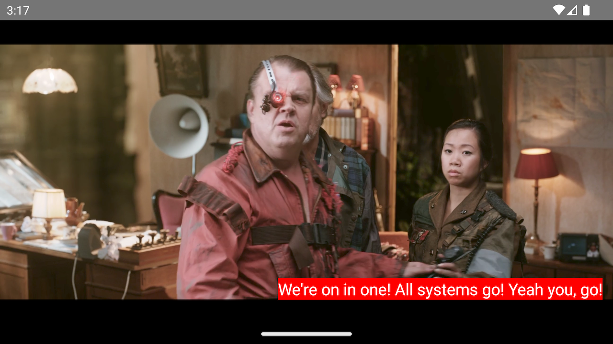
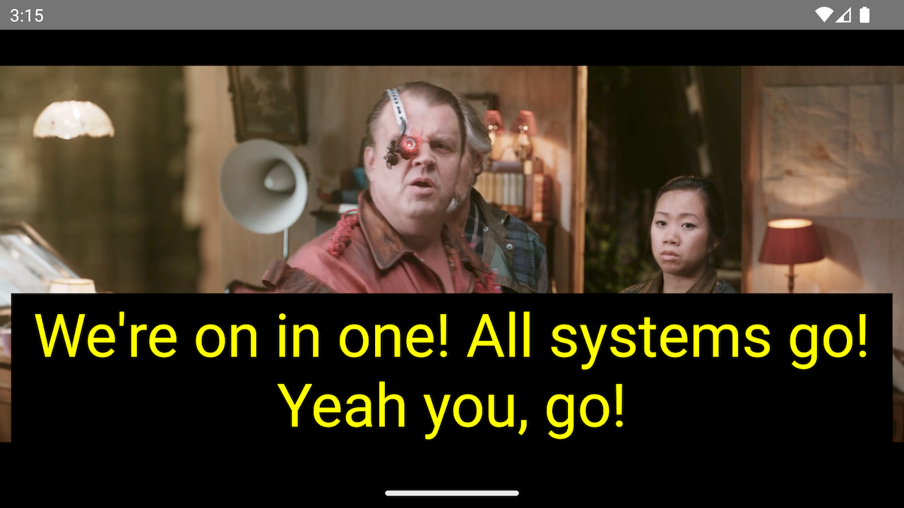
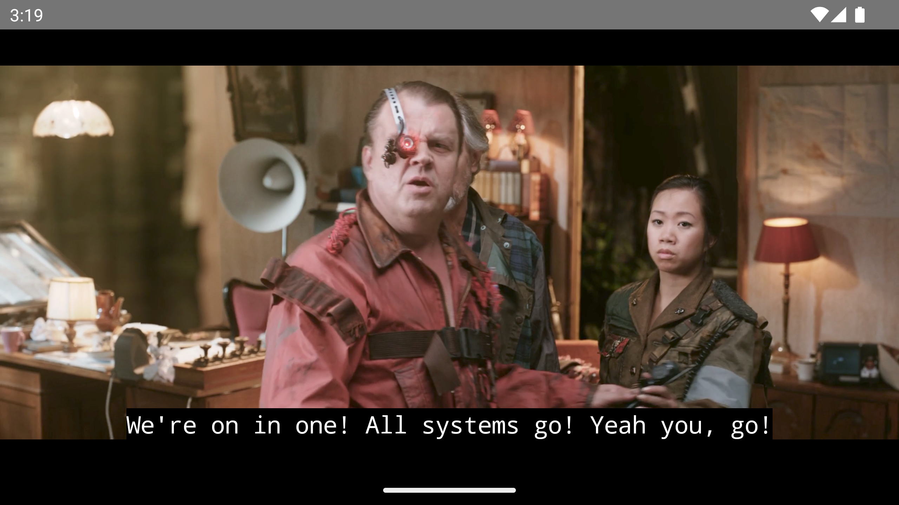

## Styling Subtitles and Closed Captions

### Overview

In this section, we showcase the functionality of THEOplayer's `TextTrackStyle` API,
which enables the customization of subtitles and closed captions' appearance. We will illustrate the practical implementation of this API through some examples.

### Style properties

| Property          | Purpose                                                           | Value                                                                                   | Support                                                            |
|-------------------|-------------------------------------------------------------------|-----------------------------------------------------------------------------------------|:-------------------------------------------------------------------|
| `fontFamily`      | The font of the text track.                                       | A string, e.g. `'serif'`, `'monospace'`, `'arial'`.                                     | All platforms,                                                     |
| `fontColor`       | The font color of the text track.                                 | A string, e.g.`'red'`, `'#ff0000'`, `'#ffc50f'` or `'rgba(255, 0, 0, 1)`.               | All platforms. The `rgba()` formatting is supported on Web only.   |
| `fontSize`        | The font size of the text track.                                  | A percentage string, e.g.`'50%'`, `'100%'` (default), `'175%'`.                         | All platforms,                                                     |
| `backgroundColor` | The color of the area directly behind the text.                   | A string, e.g.`'red'`, `'#ff0000'`, `'#ffc50f'` or `'rgba(255, 0, 0, 1)`.               | All platforms. The `rgba()` formatting is supported on Web only.   |
| `windowColor`     | The color of the area covering the full width of the text track.  | A string, e.g.`'red'`, `'#ff0000'`, `'#ffc50f'` or `'rgba(255, 0, 0, 1)`.               | Web and Android. The `rgba()` formatting is supported on Web only. |
| `edgeStyle`       | The edge style of the text.                                       | An enum value, either `none` (default), `dropshadow`, `raised`, `depressed`, `uniform`. | All platforms.                                                     |
| `marginTop`       | The top margin of the area where subtitles are being rendered.    | A positive numeric value specifying the number of pixels.                               | All platforms.                                                     |
| `marginLeft`      | The left margin of the area where subtitles are being rendered.   | A positive numeric value specifying the number of pixels.                               | All platforms.                                                     |
| `marginBottom`    | The bottom margin of the area where subtitles are being rendered. | A positive numeric value specifying the number of pixels.                               | Web only.                                                          |
| `marginRight`     | The right margin  of the area where subtitles are being rendered. | A positive numeric value specifying the number of pixels.                               | Web only.                                                          |

### Examples

<table>

<tr valign="top">

<td>



</td>

<td>

```typescript
player.textTrackStyle.backgroundColor = 'red';
player.textTrackStyle.marginLeft = 45;
```

</td>

</tr>

<tr valign="top">

<td>



</td>

<td>

```typescript
player.textTrackStyle.windowColor = 'black';
player.textTrackStyle.fontColor = '#ffff00ff';
player.textTrackStyle.fontSize = '250%';
```

</td>

</tr>

<tr valign="top">

<td>



</td>

<td>

```typescript
player.textTrackStyle.fontFamily = 'monospace';
```

</td>

</tr>

</table>


