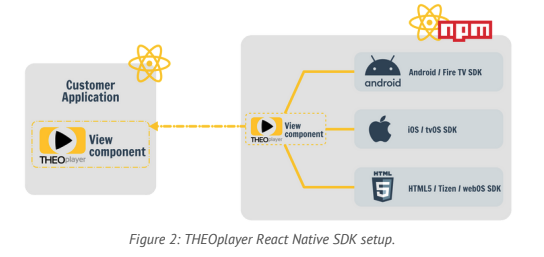

# The `THEOplayerView` Component

THEOplayer React native SDK is an NPM package, which exposes the THEOplayerView component that can be added to your
React Native projects.



This section will discuss the most important properties of `THEOplayerView`.
The component's properties are also described in detail in
its [THEOplayerViewProps interface](../src/api/THEOplayerView.ts).

THEOplayer React Native SDK uses HTML5/ Tizen/ webOS SDK, Android/ Fire TV SDK, and iOS/ tvOS SDK under the hood through
bridges that map each THEO SDK API to the THEOplayerView component.

## Properties

The `THEOplayerView` component supports the following list of properties.

| Property          | Description                                                                                                       | Platforms     |
|-------------------|-------------------------------------------------------------------------------------------------------------------|---------------|
| `config`          | The player configuration containing the THEOplayer license and other player-setup related properties              | All           |
| `style`           | The style applied to the player view.                                                                             | All           |
| `onPlayerReady`   | A callback that provides the [THEOplayer API](../src/api/player/THEOplayer.ts) when the player instance is ready. | All           |
| `onPlayerDestroy` | A callback is called when the internal player instance will be destroyed.                                         | All           |

## Configuration

The `THEOplayerView` component accepts a `config` property that contains basic player configuration.

```typescript
const player: PlayerConfiguration = {
  license: undefined, //'insert THEOplayer license for react-native here'
  chromeless: true,
};
```

The `license` is an obfuscated string that contains the THEOplayer license needed for play-out, and which can be found
in your THEOplayer Portal account. You can generate a license specifically for react-native, but if separate licenses per platform are needed, `Platform.select()` could be used to
configure them:

```typescript
const license = Platform.select(
  {
    'android': undefined, // insert Android THEOplayer license here
    'ios': undefined,     // insert iOS THEOplayer license here
    'web': undefined,     // insert Web THEOplayer license here
  });
```

If no license is provided, only sources hosted on the `theoplayer.com` domain can be played. On Web platforms,
CORS rules applied on `theoplayer.com` will also prohibit playing sources from this domain.

### Adaptive Bitrate (ABR) configuration

On Android and Web platforms, you can control the ABR configuration using `player.abr` on
the [THEOplayer API](../src/api/player/THEOplayer.ts).
We refer to the [Adaptive Bitrate (ABR)](abr.md) page for detailed information, including examples.

### Chromeless vs. Chromefull

`PlayerConfiguration.chromeless` relates to whether the underlying _native_ SDK provides the UI or not.
If `chromeless = true`, the player does not include the native UI provided by the SDK and it is expected the UI is
created in React Native. The accompanying example application provides a basic UI created in React Native.

### Native UI language

`PlayerConfiguration.ui` has a configuration property 'language' that allows you to set the language for localisation when native UI elements (e.g. 'skip ad' being displayed on the skip butten in the ad UI) are presented to the user. This only applies to UI elements rendered by the native SDK's and not to other UI elements added via your react-native view stack.

## Setting a source

You can set a source using the `source` property on the [THEOplayer API](../src/api/player/THEOplayer.ts). The type
definition of `SourceDescription` maps to the type used in
the [Web SDK's documentation](https://docs.theoplayer.com/api-reference/web/theoplayer.sourcedescription.md).

```typescript
player.source = {
    "sources": {
        "src": "https://cdn.theoplayer.com/video/elephants-dream/playlist-single-audio.m3u8",
        "type": "application/x-mpegurl"
    }
}
```

## Seeking to a position in a stream

Changing the player's current time, or seeking to a specific timestamp, is done by setting `currentTime`
on the [THEOplayer API](../src/api/player/THEOplayer.ts).
Timestamps are measured in milliseconds.

```typescript
player.currentTime = 20_000; // msec
```

## Text tracks and media tracks

The text tracks and media tracks available in the stream are provided by the `PlayerEventType.LOADED_METADATA` event,
which is dispatched by the [THEOplayer API](../src/api/player/THEOplayer.ts).

```typescript
import { PlayerEventType } from "./PlayerEventMap";
import { LoadedMetadataEvent } from "./PlayerEvent";

const onLoadedMetadata = (event: LoadedMetadataEvent) => {
  console.log(TAG, 'loadedmetadata', JSON.stringify(event));
};

player.addEventListener(PlayerEventType.LOADED_METADATA, onLoadedMetadata)
```

The `PlayerEventType.TEXT_TRACK_LIST` event can be used to dynamically listen to text tracks that are being added,
removed or changed. Similarly, for text track cues, the `PlayerEventType.TEXT_TRACK` event provides knowledge on cues
being added or removed.

The `PlayerEventType.MEDIA_TRACK_LIST` event can be used to dynamically listen to audio and video tracks (being added,
removed or changed). On Android and Web, media tracks trigger the `PlayerEventType.MEDIA_TRACK` callback with
information on quality changes. This information is not available on iOS systems.

## Preview thumbnails

Preview thumbnails are contained in a dedicated thumbnail track, which is a text track of kind `metadata` with label
`thumbnails`. The track can be either side-loaded to the stream source, or contained in a stream manifest, as the demo
sources in the [example application](./example-app.md) demonstrate. The example also contains an implementation
of a thumbnail viewer.

## Buffering state changes

The `PlayerEventType.WAITING` event is dispatched to indicate that the player has stopped playback because the next
frame's data is currently unavailable, but is expected to come in soon.
It could be coupled to an activity indicator that is part of the UI.
The `PlayerEventType.PLAYING` event is dispatched once playback continues.

Alternatively, changes in `readyState` could be observed through the `PlayerEventType.READYSTATE_CHANGE` event.
Since this value can sometimes switch radically, it is advised
to add a time-out when using `PlayerEventType.READYSTATE_CHANGE` in combination with a UI loading indicator.

The UI of the [example application](./example-app.md) illustrates a possible implementation.
