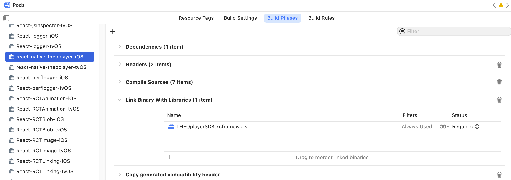

# React Native THEOplayer - custom THEOplayer portal build for iOS/tvOS

 

## Drop default cocoapod dependency

To use a custom portal build of the THEOplayerSDK for iOS or tvOS, you need to drop the current dependency of the react native package to the THEOplayerSDK-basic pod. After installing the react-native-theoplayer npm package with 
```
npm i react-native-theoplayer
```
you need to remove 
```
s.dependency "THEOplayerSDK-basic"
```
from react-native-theoplayer.podspec in _[yourProjectFolder]/node_modules/react-native-theoplayer_ and run
```
pod update
```
This should remove the dependency to the basic THEOplayer SDK.

## Generate/download custom THEOplayer builds

To make use of more advanced features of THEOplayer, you should build a custom SDK with those features enabled from the THEO portal (https://portal.theoplayer.com/). Once the iOS and/or tvOS SDK's are build, you can move the custom xcframeworks from the zip archive to your application folder: e.g.
```
[yourProjectFolder]/ios/Frameworks/iOS/THEOplayerSDK.xcframework
[yourProjectFolder]/ios/Frameworks/tvOS/THEOplayerSDK.xcframework
```

## Link custom frameworks to pods project

Open the xcworkspace containing your application and the **Pods** project generated during 'pod install'

Link to these frameworks from the Pods project
<br/>
(Add separate framework links for each platform if you are using both iOS and tvOS)

The linked frameworks should appear in the project navigation:
<br/>

## Link custom frameworks to your application
Also add dependecies to these custom frameworks from your application project (the same way you did this for the **Pods** project).

## 3th party THEOplayer dependencies
If the custom THEOplayer SDK has dependencies to other libraries (e.g. google IMA) you can add these dependencies to the podSpec of the react-native-theoplayer node module, or you can add these dependencies as frameworks just like we did for the THEOplayer SDK.

Google IMA cocoapod example: Add to react-native-theoplayer.podspec:
```
s.ios.dependency “GoogleAds-IMA-iOS-SDK”
s.tvos.dependency “GoogleAds-IMA-tvOS-SDK”
```
and run
```
pod update
```
to update the **Pods** project. The Google IMA cocoapods will appear in the **Pods** project's Pods folder as dependecies for the THEOplayer frameworks. 